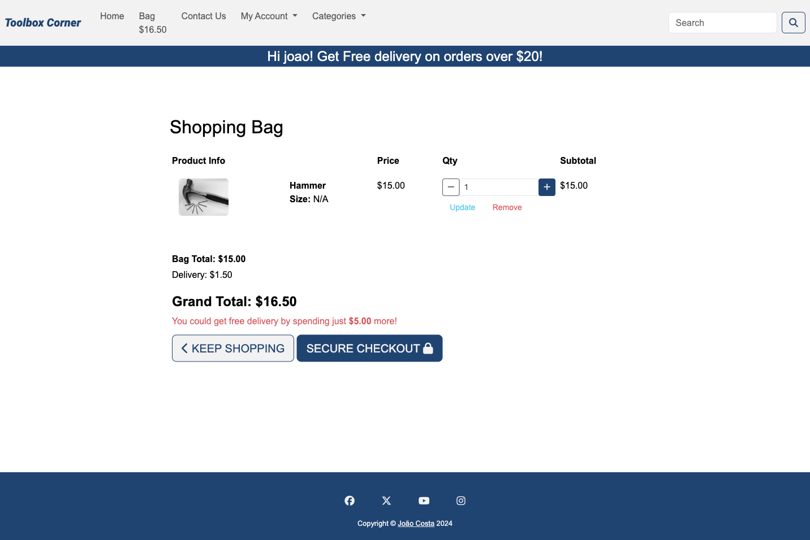

# Features

## Access to pages according to the user role:

| Page Name | Logged out  | Customers  | Staff Member | Admin |
| --------- | ----------- | ---------- | ------- | ----- |
| Welcome   | Yes         | Yes        | Yes     | Yes   |
| Sign in   | Yes         | Yes        | Yes     | Yes   |
| Register  | Yes         | Yes        | Yes     | Yes   |
| Sign out  | Yes         | Yes        | Yes     | Yes   |
| Products (Home)| Yes         | Yes        | Yes     | Yes   |
| Product Detail| Yes         | Yes        | Yes     | Yes   |
| Reviews   | Yes         | Yes        | Yes     | Yes   |
| Add Review| No         | Yes        | Yes     | Yes   |
| Edit Reviews| No         | Yes        | Yes     | Yes   |
| Delete Reviews | No         | Yes        | Yes     | Yes   |
| Contact Us| Yes         | Yes        | Yes     | Yes   |
| Bag       | No         | Yes        | Yes     | Yes   |
| Checkout  | No         | Yes        | Yes     | Yes   |
|Checkout success| No         | Yes        | Yes     | Yes   |
| Categories| Yes         | Yes         | Yes     | Yes   |
| Search Results| Yes         | Yes         | Yes     | Yes   |
|Add product| No         | No         | Yes     | Yes   |
|Edit product| No         | No         | Yes     | Yes   |
|Delete product| No         | No         | Yes     | Yes   |

 
 - Each page has a navbar and a footer

 **Navbar**

Navbar has the following links:
- home
- Contact Us
- Bag (only visible when logged in)
- My Account
  - Register (only visible when logged out)
  - Login (only visible when logged out)
  - Log out (only visible when logged in)
  - Add Product (only visible when logged in with Admin or Staff member)
- Categories (categories list may change if Admin changes it)
  - Hand tools
  - Power tools
  - Nails, Screws and Nuts
  - Wood
- Search Bar

The "Toolbox Corner" logo leads to the Products (home), page if pressed.

**Footer**

- Footer has the usual links for social media and the link the creator's github profile

**Welcome Page**

- A welcome note for the user to know what the page is about with a link to the products (home) page.

**Sign In page**

- The Sign In page has the user name and the password the fill in.
- A Sign In button which directs the user to the home page, if the credentials are correct.
- If you are new, there is a link for the sign up in the description
and the navbar opens up a register button that leads to the sign up page as well.
- You can recover you password by pressing the forgot password button.

**Sign up page**

- This page asks for several fields to be filled upt for registration:
  - Email
  - Email confirmation
  - Username
  - Password 
  - Password (again)

- A link for the sign in is provided on the top on order to go back to the sign in page if necessary.

**Sign out page**

- This page shows a button to sign out and a cancel wich directs the user to the welcome page

**Procuts (Home) Page**

- This is the main page after welcome page. 
- Here the user can:

  - Check the available products with its prices and ratings as long as a small descrition

**Product Detail**

- Here the user can:

  - Check product with its prices and ratings as long as a full description.
  - User can add the desired amount of items from this product and add them to the bag
  - The user can also go to the reviews page to check the reviews or leave a review.

**Reviews**

- Here the user can:

  - Check the product reviews.
  - User can go to add review and delete or edit their review of the product.

**Add Review**

- Here the user can:

  - Add a review of the product anr rate it from 1 to 5 stars.

**Edit Review**

- Here the user can:

  -  Edit the previously given review of the product and rate it from 1 to 5 stars.

**Delete Review**

- Here the user can:

  -  Delete the previously given review of the product and rate it from 1 to 5 stars.

**Contact Us**

- Here the user can:

  -  Send a message to inquire the store.

**Bag**

- Here the user can:

  -  Fill in their information, including card info, to pay for the selected products.
  -  Check which products and the amount of each selected.
  -  Add/remove items to the bag for each product.
  -  Remove completely the product.
  -  Proceed to the checkout page.

**Checkout**

- Here the user can:

  -  Fill in their information, including card info, to pay for the selected products.
  -  Confirm the purchase.

**Checkout Success**

- Here the user can:

  -  Get a detailed confirmation of purchase.

**Categories**

- Here the user can:

  -  Check the existing products on the chosen category.

**Search Results**

- Here the user can:

  -  Check the existing products with the chosen words.

**Add Product**

- Here the Staff member/Admin can:

  -  Add a new product, including several pictures.

**Edit Product**

- Here the Staff member/Admin can:

  -  Edit the selected product, including delete, replace and add pictures.

**Delete Product**

- Here the Staff member/Admin can:

  -  Delete the selected product, including the pictures.

**Favicon**

  

  The favicon is a small image that is displayed in the browser's address bar. It is used to identify the website among others and help the user to find it when he/she is searching for it.

**Admin**

- Only Admin (superuser) can have full access to manage the app and can give staff member permition to a user.
- Only Admin can add, edit or delete categories through the admin interface.
- Only Admin can check the messages sent to the Contact Us through the admin interface.

**Future features improvements**

 - Include wish list.
 - Direct Chat.
 - Several staff roles.
 - Add a profile page that saves the adress.
 - Have a stock record.
 - Add reviews only after delivery.

