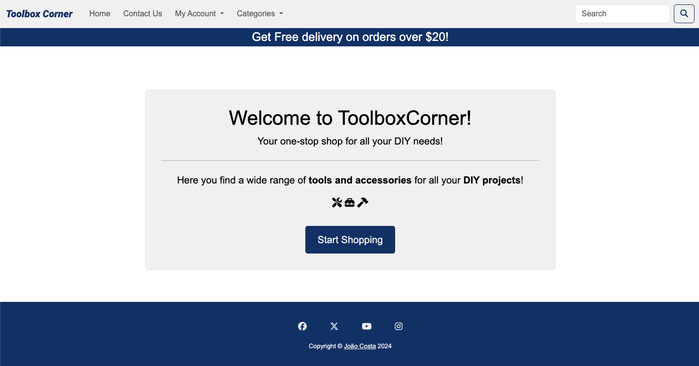
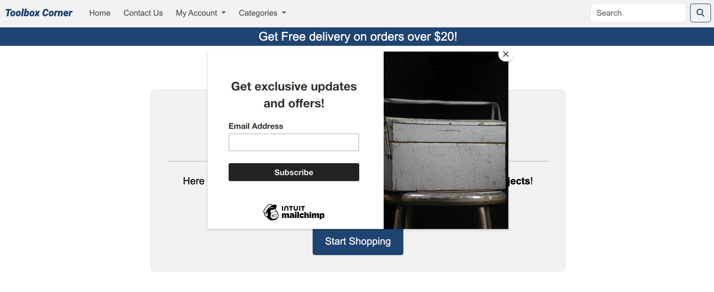
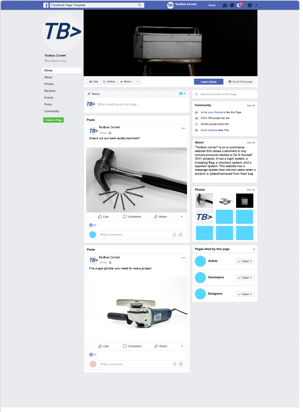
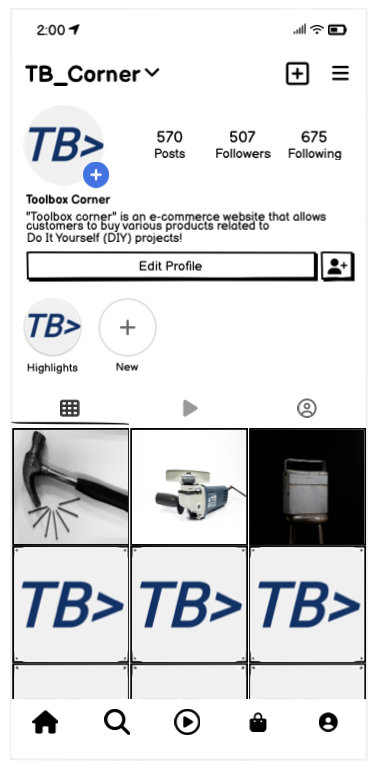
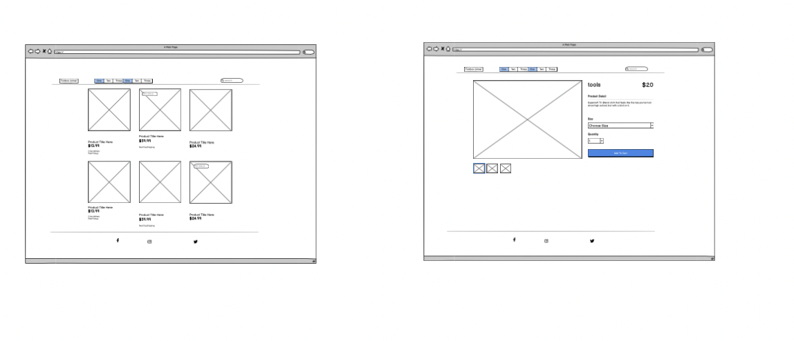
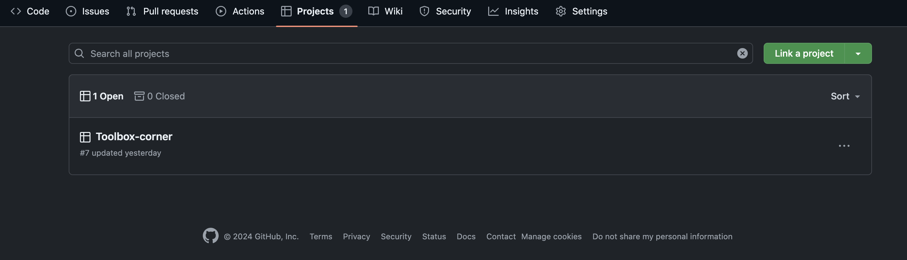
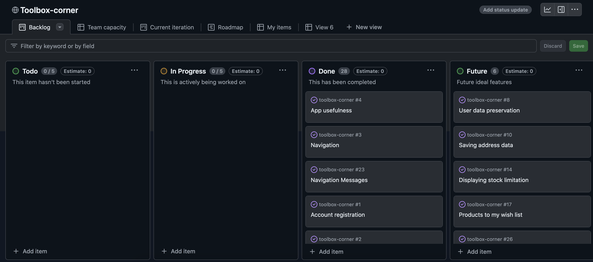
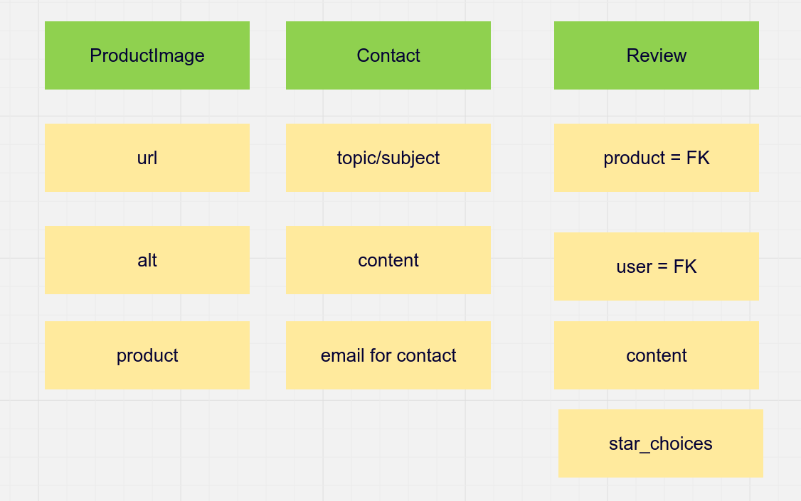

#  Toolbox corner - E-commerce website

Live Version: [Toolbox Corner](https://toolbox-corner-c9446b25bd36.herokuapp.com/)


Repository: [GitHub Repo](https://github.com/Johns-Costa/toolbox-corner)

The app is developed by [João Costa](https://github.com/Johns-Costa).




## About

"Toolbox corner" is an e-commerce website that allows customers to buy various products related to Do It Yourself (DIY) projects. It has a login system, a shopping Bag, a checkout system, and a payment system. This website has a message system that informs users when a product is added/removed from their bag.
In addition, the website has a personnel functionality that allows admin, and staff members to manage the website. The decision to implement two personnel roles was made in order to create the project that can possibly be scalable and reusable in the real world.

---

## UX

The website was created to be eye-catching and user-friendly. The user is given plenty of choices to choose from when they are shopping. The user can navigate the website easily to fulfill users' goals. The website is designed to be easy to use and easy to understand.
It handles personnel functionality admin and staff member.
Business goals were to make the website as scalable as possible and reusable in the real world.

### Target Audience

This website is intended for people interested in purchasing DIY products online. From a first time DIYer to an experienced one. It was also aimed to lure people into using this website in their daily lives. This website may hold many products related to tools and construction suplies, and it is essential to make sure that the website is easy to use and navigate. The categories (which can be added/edited and deleted by the Admin) help the user to find what they are looking for.

#### First Time Visitor

| Issue ID    | User Story |
|-------------|-------------|
| [#1](https://github.com/Johns-Costa/toolbox-corner/issues/1) | As a First Time Visitor, I want to be able to register my account,, so that I can learn the benefits of the app as a user. |
| [#2](https://github.com/Johns-Costa/toolbox-corner/issues/2) | As a First Time Visitor, I want to be able to easily understand the main purpose of the app, so that I can learn more about this app. |
| [#3](https://github.com/Johns-Costa/toolbox-corner/issues/3) | As a First Time Visitor, I want to be able to easily navigate through the app, so that I can find the content. |
| [#4](https://github.com/Johns-Costa/toolbox-corner/issues/4) | As a First Time Visitor, I want to be able to find the app useful, so that I can use it according to my needs. |
| [#5](https://github.com/Johns-Costa/toolbox-corner/issues/5) | As a First Time Visitor, I want to be informed clearly if I am making any errors when registering my account, so that I can be able to fix any errors quickly if I make some. |
| [#6](https://github.com/Johns-Costa/toolbox-corner/issues/6) | As a First Time Visitor, I want to be able to see the list of products, so that I can learn the benefits of the app as a user. |
| [#34](https://github.com/Johns-Costa/toolbox-corner/issues/34) | As a First Time Visitor I want to be able to receive and email confirmation after registering, so that I can verify that my account registration was successful. |


#### Regular User (Customer)

| Issue ID    | User Story |
|-------------|-------------|
| [#7](https://github.com/Johns-Costa/toolbox-corner/issues/7) | As a Regular User, I want to be able to access my account without having to log in every time, so that I can quickly buy a product that I need. |
| [#8](https://github.com/Johns-Costa/toolbox-corner/issues/8) | As a Regular User, I want to be able to view my data, so that I can easily check my account details and past order *(Future development)* |
| [#9](https://github.com/Johns-Costa/toolbox-corner/issues/9) | As a Regular User, I want to be able to search for a product, so that I can get the most appropriate choices, so that I am likely to find what I am looking for.|
| [#10](https://github.com/Johns-Costa/toolbox-corner/issues/10) | As a Regular User, I want to be able to add, edit, and save my address data, so that I can make an order faster. *(Future development)* |
| [#11](https://github.com/Johns-Costa/toolbox-corner/issues/11) | As a Regular User, I want to be able to search products by category, so that I can find a product faster. |
| [#12](https://github.com/Johns-Costa/toolbox-corner/issues/12) | As a Regular User, I want to be able to leave a product review, so that I can share my feedback. |
| [#13](https://github.com/Johns-Costa/toolbox-corner/issues/13) | As a Regular User, I want to be able to see ratings and reviews on a product, so that I can make a prudent decision before buying it. |
| [#14](https://github.com/Johns-Costa/toolbox-corner/issues/14) | As a Customer, I want to be able to see if the product is about to go out of stock, so that I can plan my purchases. *(Future development)* |
| [#15](https://github.com/Johns-Costa/toolbox-corner/issues/15) | As a Customer, I want to be able to See a full product description (image, name, description, options, price), so that I can understand whether I want to buy this product. |
| [#16](https://github.com/Johns-Costa/toolbox-corner/issues/16) | As a Customer, I want to be able to see (if available) the product’s options (size), so that I can understand whether the option of the product suits me. |
| [#17](https://github.com/Johns-Costa/toolbox-corner/issues/17) | As a Customer, I want to be able to add, edit and remove products to my wish list, so that I can buy it later. *(Future development)* |
| [#18](https://github.com/Johns-Costa/toolbox-corner/issues/18) | As a Customer, I want to be able to increase/reduce the number of product items that I want to buy on the product detail page, so that I can buy a number of items that I want. |
| [#19](https://github.com/Johns-Costa/toolbox-corner/issues/19) | As a Customer, I want to be able to add products to my bag, so that I can easily save products in the bag. |
| [#20](https://github.com/Johns-Costa/toolbox-corner/issues/20) | As a Customer, I want to be able to see the counted total cost, so that I can see how much I will spend. |
| [#21](https://github.com/Johns-Costa/toolbox-corner/issues/21) | As a Customer, I want to be able to increase/reduce quantify of items in my bag, so that I can buy a number of items that I want. |
| [#22](https://github.com/Johns-Costa/toolbox-corner/issues/22) | As a Customer, I want to be able to remove the product from my bag, so that I can change my mind not to buy a particular product at the last moment. |
| [#23](https://github.com/Johns-Costa/toolbox-corner/issues/23) | As a Customer, I want to be able to see messages from the shop, so that I can understand whether an item is actually added to the bag or removed. |
| [#24](https://github.com/Johns-Costa/toolbox-corner/issues/24) | As a Customer, I want to be able to contact shop, so that I can get an answer to my questions or issues with products. |
| [#25](https://github.com/Johns-Costa/toolbox-corner/issues/25) | As a Customer who made a purchase, I want to be able to see order confirmation after checkout, so that I can see what I bought. |
| [#26](https://github.com/Johns-Costa/toolbox-corner/issues/26) | As a Regular user, I want to be able to change my profile data, so that I can keep my profile up to date. |
| [#32](https://github.com/Johns-Costa/toolbox-corner/issues/32) | As a Site User, I want to be able to login and logout, so that I can buy product and end session. |
| [#33](https://github.com/Johns-Costa/toolbox-corner/issues/33) | As a Site User I want to be able to, easily recover my password if I forget it, so that I recover access to my account. |

#### Staff member + Admin

| Issue ID    | User Story |
|-------------|-------------|
| [#27](https://github.com/Johns-Costa/toolbox-corner/issues/27) | As an Admin, I want to be able to add, edit, and delete category, so that I can keep products’ categories up to date. |
| [#28](https://github.com/Johns-Costa/toolbox-corner/issues/28) | As an Admin and a Staff Member, I want to be able to add, edit, and delete products, so that I can keep shop products up to date. |
| [#29](https://github.com/Johns-Costa/toolbox-corner/issues/29) | As an Admin, I want to be able to view customers' data, so that I can contact customers if needed and solve possible problems with purchases. |
| [#30](https://github.com/Johns-Costa/toolbox-corner/issues/30) | As an Admin, I want to be able to review customers’ orders, so that I can control orders. |
| [#31](https://github.com/Johns-Costa/toolbox-corner/issues/31) | As an Admin, I want to be able to Allow customers to leave reviews only after they receive a product, so that I can control that reviews are relevant. |

## Business Model

Toolbox Corner operates on a B2C (Business-to-Consumer) model, focusing on individual transactions by selling products directly to customers.

### Customer Persona Summary

Toolbox Corner caters to a diverse group of individuals with varying needs and preferences. The target audience includes:

- **Age**: 18 and older.
- **Demographics**: DIY enthusiasts, professional tradespeople, home improvement hobbyists, and anyone in need of tools.
- **Needs and Wants**: Customers seek high-quality tools, detailed product information, user-friendly browsing, and efficient service.
- **Experience Focus**: Emphasis on a seamless user experience with easy navigation, comprehensive product details, and excellent customer service to help customers find the right tools quickly and efficiently.

### Store Personnel Persona Summary

Toolbox Corner is designed for companies of all sizes interested in selling tools online. The platform supports potential growth with comprehensive functionalities for store personnel, including:

- **Small to Large Companies**: Whether a small business or a large corporation, the platform accommodates various business scales.
- **Personnel Functionality**: Full control over products add/edit and delete.
- **User Roles**: Admin and staff member.

### Strategy Trade-Off

Toolbox Corner is a competitive online store due to its diverse product offerings, affordability, and quality. Key strategic advantages include:

- **Variety**: A wide range of tools and equipment.
- **Availability**: Consistent stock and timely restocking.
- **Quality**: High-quality, reliable products.
- **Choice**: Extensive selection catering to various needs.
- **User Experience**: Intuitive, user-friendly interface.
- **Contact**: Excellent customer service with quick response times.
- **Unique Customer Service**: Personalized service, including handling custom product requests and providing detailed guidance on tool usage.

---

## Web Marketing

### 1. Newsletters

Toolbox Corner utilizes Mailchimp for creating and sending newsletters to all customers that subscribe. The Admin can design a newsletter and distribute it efficiently through Mailchimp, which also handles sending newsletters about new products and eventual sales.




### 2. Facebook

Facebook is crucial for Toolbox Corner to reach its customers effectively. The platform has a broad user base, providing excellent coverage among potential customers who prefer online shopping. The Toolbox Corner Facebook page is used for marketing purposes, posting adverts, engaging content, and interacting with users.



### 3. Instagram

Instagram is essential for attracting a younger demographic, with 90% of its users being under 35 years old. Toolbox Corner's Instagram page is leveraged for marketing purposes, including posting adverts, interesting content, and engaging users.



---

## Future Development


### Sorting Products by Price and Reviews

Dependent on business requirements, this feature can be added to allow customers to sort products based on prices and reviews.

### Third-Party Registration

Future third-party registration options may include Google, while Facebook and Twitter integration will be considered based on further business requirements.

### Payment System

Future plans include integrating PayPal, Alipay, and WeChat payment systems to complement the existing Stripe payment system.

### Suppliers App

A suppliers app is planned to manage supplier interactions and product offerings, significantly boosting productivity and sales.

### Order Cancellation

Further research is required to implement order cancellation effectively.

### Elastic Search

Elastic Search will be considered for improving search speed and result quality in future development phases.

### Delivery Cost Calculation

Future plans include developing a flexible delivery cost calculation system considering various factors such as shipping fees, distance, weight, package size, product value, payment method, tax rates, and more. Currently, free delivery is included in the product price for orders over 20 dollars and a 10% fee is charged for orders under this ammount.

---

## Technologies used
- ### Languages:
    
    + [Python 3.12.3](https://www.python.org/downloads/release/python-3123/): the primary language used to develop the server-side of the website.
    + [JS](https://www.javascript.com/): the primary language used to develop interactive components of the website.
    + [HTML](https://developer.mozilla.org/en-US/docs/Web/HTML): the markup language used to create the website.
    + [CSS](https://developer.mozilla.org/en-US/docs/Web/css): the styling language used to style the website.

- ### Frameworks and libraries:

    + [Django](https://www.djangoproject.com/): python framework used to create all the logic.
    + [jQuery](https://jquery.com/): was used to control click events and sending AJAX requests.
    + [jQuery User Interface](https://jqueryui.com/) was used to create interactive elements.

- ### Databases:

    + [SQLite](https://www.sqlite.org/): was used as a development database.
    + [PostgreSQL](https://www.postgresql.org/): the database used to store all the data.


- ### Other tools:

    + [Git](https://git-scm.com/): the version control system used to manage the code.
    + [Pip3](https://pypi.org/project/pip/): the package manager used to install the dependencies.
    + [Gunicorn](https://gunicorn.org/): the web server used to run the website.
    + [Psycopg2](https://www.psycopg.org/): the database driver used to connect to the database.
    + [Django-allauth](https://django-allauth.readthedocs.io/en/latest/): the authentication library used to create the user accounts.
    + [Django-crispy-forms](https://django-cryptography.readthedocs.io/en/latest/): was used to control the rendering behavior of Django forms.
    + [Render](https://pypi.org/project/render/): was used to render the README file.
    + [GitHub](https://github.com/): used to host the website's source code.
    + [VSCode](https://code.visualstudio.com/): the IDE used to develop the website.
    + [Chrome DevTools](https://developer.chrome.com/docs/devtools/open/): was used to debug the website.
    + [Font Awesome](https://fontawesome.com/): was used to create the icons used in the website.
    + [Draw.io](https://www.lucidchart.com/) was used to make a flowchart for the README file.
    + [W3C Validator](https://validator.w3.org/): was used to validate HTML5 code for the website.
    + [W3C CSS validator](https://jigsaw.w3.org/css-validator/): was used to validate CSS code for the website.
    + [JShint](https://jshint.com/): was used to validate JS code for the website.
    + [PEP8](https://pep8.org/): was used to validate Python code for the website.
    + [geonames](https://www.geonames.org/) was used to get the country and city names.
    + [stripe](https://stripe.com/): was used to create the payment system.
    + [birme.net](https://www.birme.net/): was used to crop and center unsplash images.
    + [Sitemap Generator](https://www.xml-sitemaps.com/) was used to create the sitemap.xml file.

---

## Features


Please refer to the [FEATURES.md](FEATURES.md) file for all test-related documentation.

---
## Design

The design of the application is based on Material Design principles. The colors are chosen to be consistent.
The minimalistic approach was used to create something meaningful without moving out of the customer's focus.

### Color Scheme

The application's color scheme is based on the combination of bold and neutral colors. The bold colors are used to create a more vibrant and attractive user experience. The neutral colors are used to create a more calm and relaxed user experience.


The navbar is colored colored with a light grey background (`#F0F0F0`) with a dark gray text and a dark blue logo (`#003366`).
The banner and the footer have a dark blue background (`#003366`) and light grey text (`#F0F0F0`) to emphasize the application's main content.

The main content has a white background with and black text in order for the user to focus on the products.

### Typography

The Logo is in [Roboto](https://fonts.google.com/?query=roboto) font and the body in Arial, sans serif in order to make it simple and easy on the eye.


### Wireframes

  

---
## Agile Methodology

### GitHub Project Management

  

GitHub Project Management played a crucial role in managing this project. Without it, overseeing the application's development would have been challenging. It enabled me to prioritize tasks effectively and monitor my progress throughout the project.



---

## Information Architecture

### Database

* During the earliest stages of the project, the database was created using SQLite.
* The database was then migrated to PostgreSQL using [Neon](https://neon.tech/).

### Entity-Relationship Diagram



### Data Modeling

#### Category Model

| Name          | Database Key  | Field Type    | Validation |
| ------------- | ------------- | ------------- | ---------- |
| name          | name          | CharField     | max_length=100 |

#### Product Model

| Name          | Database Key  | Field Type    | Validation |
| ------------- | ------------- | ------------- | ---------- |
| name          | name          | CharField     | max_length=100 |
| description   | description   | TextField     | max_length=400 |
| price         | price         | DecimalField  | max_digits=10, decimal_places=2 |
| has_sizes     | has_sizes     | BooleanField  | default=False, null=True, blank=True |
| created_by    | created_by    | ForeignKey    | User, null=True, blank=True, on_delete=models.SET_NULL |
| created_at    | created_at    | DateTimeField | auto_now_add=True |
| modified_at   | modified_at   | DateTimeField | auto_now_add=True |
| category      | category      | ForeignKey    | Category, null=True, blank=True, on_delete=models.SET_NULL, related_name='products' |

#### Product Image Model

| Name          | Database Key  | Field Type    | Validation |
| ------------- | ------------- | ------------- | ---------- |
| product       | product       | ForeignKey    | Product, on_delete=models.CASCADE, related_name='images' |
| image         | image         |CloudinaryField| image', default='placeholder' |
| alt           | alt           | CharField     | max_length=50, blank=True, null=True |

#### Review Model

```python
    STAR_CHOICES = [(i, str(i)) for i in range(6)]
```

| Name          | Database Key  | Field Type    | Validation |
| ------------- | ------------- | ------------- | ---------- |
| product       | product       | ForeignKey    | Product, on_delete=models.CASCADE |
| user          | user          | ForeignKey    | settings.AUTH_USER_MODEL, on_delete=models.CASCADE |
| content       | content       | TextField     | max_length=500, blank=True |
| stars         | stars         | IntegerFiel   | choices=STAR_CHOICES |
| created_at    | created_at    | DateTimeField | auto_now_add=True |
| updated_at    | updated_at    | DateTimeField | auto_now=True |

#### Contact Model

```python
       SUBJECT_CHOICES = [
        ('problems', 'Problems'),
        ('product_info', 'Product Information'),
        ('general_info', 'General Information'),
        ('work_with_us', 'Work with Us'),
        ('other', 'Other'),

    ]
```

| Name          | Database Key  | Field Type    | Validation |
| ------------- | ------------- | ------------- | ---------- |
| subject       | subject       | CharField     | max_length=50, choices=SUBJECT_CHOICES |
| content       | content       | TextField     | validators=[MinLengthValidator(10), MaxLengthValidator(500)] |
| email         | email         | EmailFiel     |  |
| created_at    | created_at    | DateTimeField | default=timezone.now |

#### Order Model

| Name          | Database Key  | Field Type    | Validation |
| ------------- | ------------- | ------------- | ---------- |
| order_number  | order_number  | CharField     | max_length=32, null=False, editable=False |
| full_name     | full_name     | CharField     | max_length=50, null=False, blank=False |
| email         | email         | EmailField    | max_length=254, null=False, blank=False |
| phone_number  | phone_number  | CharField     | max_length=20, null=False, blank=False|
| country       | country       | CountryField  | blank_label='Country *', null=False, blank=False |
| postcode      | postcode      | CharField     | max_length=20, null=False, blank=True |
| town_or_city  | town_or_city  | CharField     | max_length=40, null=False, blank=False |
| street_adress1| street_adress1| CharField     | max_length=80, null=False, blank=False |
| street_adress2| street_adress2| CharField     | max_length=80, null=True, blank=True |
| county        | county        | CharField     | max_length=80, null=True, blank=True |
| date          | date          | DateTimeField | auto_now_add=True |
| delivery_cost | delivery_cost | DecimalField  | max_digits=6, decimal_places=2, null=False, default=0 |
| order_total   | order_total   | DecimalField  | max_digits=10, decimal_places=2, null=False, default=0 |
| grand_total   | grand_total   | DecimalField  | max_digits=10, decimal_places=2, null=False, default=0 |
| original_bag  | original_bag  | TextField     | null=False, blank=False, default='' |
| stripe_pid    | stripe_pid    | CharField     | max_length=254, null=False, blank=False, default='' |


#### Order Line Item Model

| Name          | Database Key  | Field Type    | Validation |
| ------------- | ------------- | ------------- | ---------- |
| order         | order         | ForeignKey    | Order, null=False, blank=False, on_delete=models.CASCADE, related_name='lineitems' |
| product       | product       | ForeignKey    | Product, null=False, blank=False, on_delete=models.CASCADE |
| product_size  | product_size  | CharField     | max_length=2, null=True, blank=True |
| quantity      | quantity      | IntergerField | null=False, blank=False, default=0|
| lineitem_total| lineitem_total| DecimalField  | max_digits=6, decimal_places=2, null=False, blank=False, editable=False |

---

## Testing

Please refer to the [TESTING.md](TESTING.md) file for all test-related documentation.

---

## Deployment


- The app was deployed to [Heroku](https://www.heroku.com/).
- The database was deployed to [Neon](https://neon.tech/).
- The app can be reached by the [link](https://toolbox-corner-c9446b25bd36.herokuapp.com/).

Please refer to the [DEPLOYMENT.md](DEPLOYMENT.md) file for all deployment-related documentation.

---

## Credits

- [GitHub](https://github.com/) for giving the idea of the project's design.
- [Django](https://www.djangoproject.com/) for the framework.
- [Neon](https://neon.tech/): for the free hosting of the database.
- [Font awesome](https://fontawesome.com/): for the free access to icons.
- [Heroku](https://www.heroku.com/): for the free hosting of the website.
- [Postgresql](https://www.postgresql.org/): for providing a free database.
- [Unsplash](https://unsplash.com/): for providing free products' images to fill out the store.
- [Pixabay](https://pixabay.com/): for providing free products' images to fill out the store.

- The footer was based on my [Thread and rope project](https://github.com/Johns-Costa/threadandrope).


---

## Acknowledgments


- [Iuliia Konovalova](https://github.com/IuliiaKonovalova) my mentor, was of a great support. Helping me figure out and mature the idea for this project.
- My wife Luciana for all the support and keeping the family together.